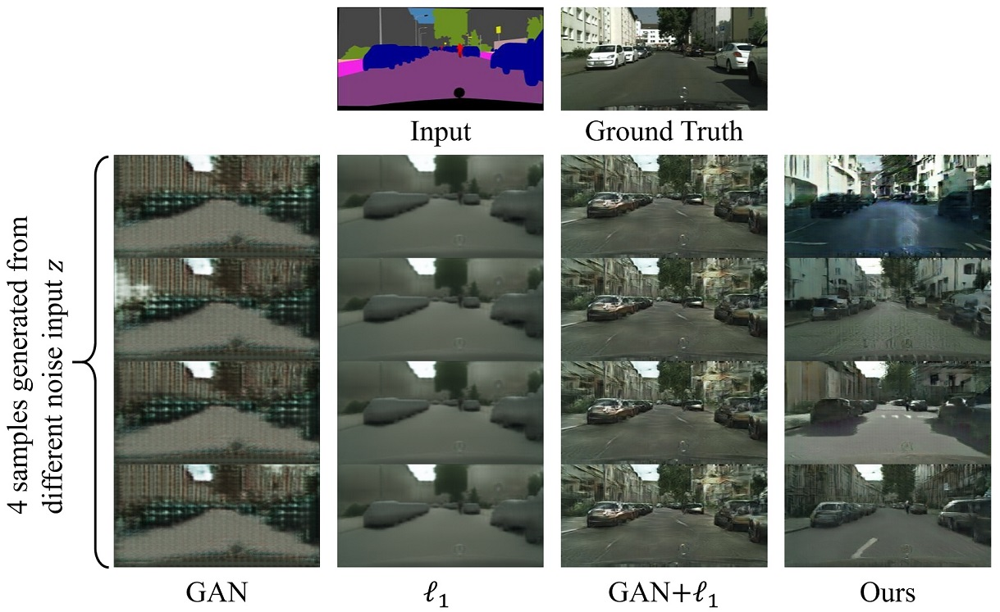
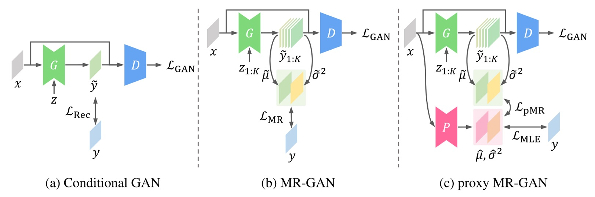
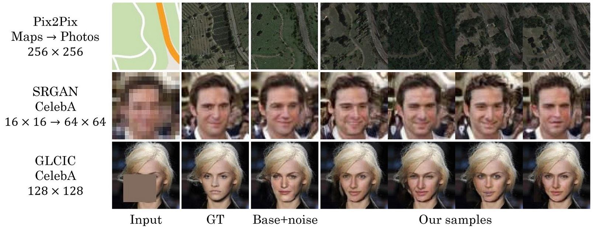

# MR-GAN

[**Project**][1] | [**Paper**][2]

Official PyTorch implementation of ICLR 2019 paper: *Harmonizing Maximum Likelihood with GANs for Multimodal Conditional Generation.*

Conditional GAN models are often optimized by the joint use of the GAN loss and reconstruction loss. We show that this training recipe shared by almost all existing methods is problematic and has one critical side effect: lack of diversity in output samples.
In order to accomplish both training stability and multimodal output generation, we propose novel training schemes with a new set of losses named *moment reconstruction losses* that simply replace the reconstruction loss.








## Reference

If you are willing to use this code or cite the paper, please refer the following:
```bibtex
@inproceedings{
    lee2019harmonizing,
    title={Harmonizing Maximum Likelihood with {GAN}s for Multimodal Conditional Generation},
    author={Soochan Lee and Junsoo Ha and Gunhee Kim},
    booktitle={International Conference on Learning Representations},
    year={2019},
    url={https://openreview.net/forum?id=HJxyAjRcFX},
}
```

## Requirements
* Python >= 3.6
* CUDA >= 9.0 supported GPU with at least 10GB memory

## Installation
```shell
$ pip install -r requirements.txt
```

## Preprocessing
### Cityscapes
We expect the original Cityscapes dataset to be located at `data/cityscapes/original`. Please refer to [Cityscapes Dataset](http://www.cityscapes-dataset.net/) and [mcordts/cityscapesScripts](https://github.com/mcordts/cityscapesScripts) for details.
```bash
$ python ./scripts/preprocess_pix2pix_data.py \
    --src data/cityscapes/original/leftImg8bit \
    --dst data/cityscapes/256x256 \
    --size 256 \
    --random-flip
```

### Maps
We expect the original Maps dataset to be located at `data/maps/original`. We recommend you to use the [dataset downloading script](https://github.com/junyanz/CycleGAN/blob/master/datasets/download_dataset.sh) of [junyanz/CycleGAN](https://github.com/junyanz/CycleGAN).
```bash
$ python ./scripts/preprocess_pix2pix_data.py \
    --src data/maps/original \
    --dst data/maps/512x512 \
    --size 512 \
    --random-flip \
    --random-rotate
```

### CelebA
We expect the original CelebA dataset to be located at `data/celeba/original` with the directory structure of `data/celeba/original/train` and `data/celeba/original/val`.
```bash
# For Super-Resolution
$ python ./scripts/preprocess_celeba.py \
    --src data/celeba/original \
    --dst data/celeba/64x64 \
    --size 64

# For Inpainting
$ python ./scripts/preprocess_celeba.py \
    --src data/celeba/original \
    --dst data/celeba/128x128 \
    --size 128
```


## Training

### MR-GAN
```bash
$ python main.py --mode mr --config ./configs/{model}-{dataset}-{distribution}-{method}.yaml --log-dir ./logs/mr
```

### Proxy MR-GAN
Train a predictor first and determine the checkpoint where the validation loss is minimized.
```bash
$ python main.py --mode pred --config configs/{model}-{dataset}-{distribution}-{method}.yaml --log-dir ./logs/predictor
```
Use the checkpoint as `--pred-ckpt` to train the generator.
```bash
$ python main.py --mode mr --config configs/{model}-{dataset}-{distribution}-{method}.yaml --log-dir ./logs/pmr --pred-ckpt ./logs/predictor/ckpt/{step}-p.pt
```


[1]: https://soochanlee.com/publications/mr-gan
[2]: https://openreview.net/pdf?id=HJxyAjRcFX
